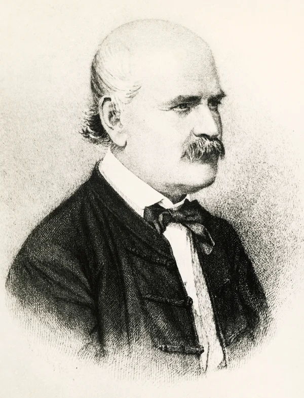
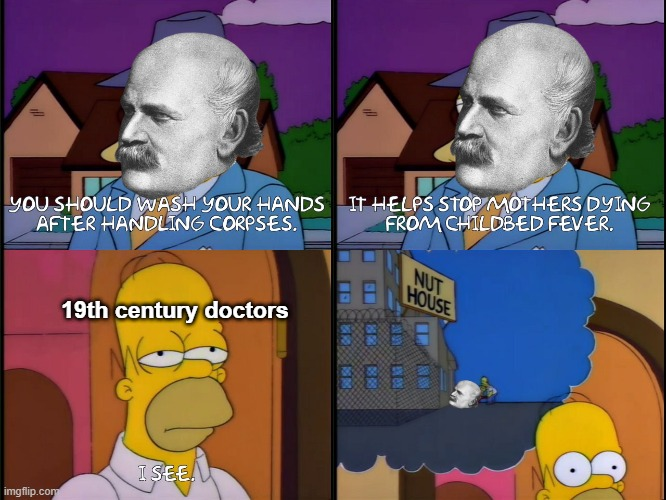

# 🧼 The Handwashing Paradox  

## Overview / What I Did
- Revisited the historical case of Dr. Ignaz Semmelweis, who discovered that handwashing, drastically reduced maternal deaths in the 1840s.
  
- Used modern data analysis tools to validate his discovery, transforming raw hospital records into actionable insights through cleaning, visualization, SQL queries, and statistical testing.

##  How 
- Data Wrangling & Cleaning: Loaded annual and monthly hospital records, calculated mortality rates, handled missing values, and structured the data for analysis. This ensured accurate and reliable insights.

- Exploratory Data Analysis (EDA): Compared mortality trends between the two clinics, visualized annual and monthly fluctuations, and marked when handwashing was introduced to show the turning point.

- SQL Integration: Wrote queries on the hospital records to calculate total births, deaths, and mortality rates before and after handwashing, showing the change in mortality clearly.

- Statistical Validation: Applied a two-sample t-test to check whether the drop in mortality rates after handwashing was statistically significant (p ≈ 7e-07).
  
- Visualization & Storytelling: Created line plots, annotated turning points, and bar charts comparing before/after metrics to clearly show the results.

## Impact  
- Showed that **maternal mortality dropped from ~10% to ~2%** after handwashing, **saving an estimated 523 lives**, showing the real-world effect of data-driven insights.

## Tools / Skills Used
- **Python:** pandas, matplotlib, scipy, sqlite3
- **Data Handling:** cleaning, aggregation, calculation of mortality rates
- **Statistical Analysis:** two-sample t-test, hypothesis testing
- **Data Visualization:** line plots, bar charts, annotated charts
- **SQL:** querying datasets inside Python
- **Environment & Cloud:** Google Colab, Google Drive, GitHub
- **Documentation:** Markdown

## Fun / Extra

(he is the guy ☝🏼, Dr.Ignaz Semmelweis) 
- Semmelweis’ idea that simple handwashing could save lives was ridiculed by his peers, and he faced extreme backlash—even being committed to a mental asylum. 
- Today, that same idea is celebrated as a life-saving breakthrough and he’s remembered as the father of infection control.

 
Check out the beautiful Google Doodle about him here: [Recognizing Ignaz Semmelweis and Handwashing](https://doodles.google/doodle/recognizing-ignaz-semmelweis-and-handwashing/)

