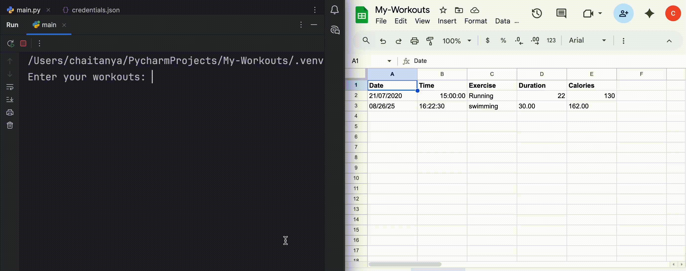

# 💪🏼Workout Logger

## Project Summary
- I built this project to learn and gain practical experience with a complete end-to-end data analytics pipeline. The project records daily workouts, calculates total calories burned and time spent, and stores all entries in Google Sheets automatically.
- It demonstrates a full analytics workflow, using Sheets, Python, Pandas, Google Sheets API, and cloud tools to capture, organize, aggregate, and summarize workout data into daily actionable insights.

## Data Workflow : collection → clean → analyze → aggregate → summarize

## What It Does & Tools Used
- Automates Data Logging: Captures user input, retrieves workout details via Nutritionix API, and logs results in Google Sheets automatically using Google Sheets API (via Google Cloud).
- Cleans & Summarizes Data: Converts duration and calorie values to numeric format, merges repeated workouts, and calculates daily totals for each exercise, ensuring data accuracy. 
- Generates Daily Insights: Produces concise summaries of total time spent and calories burned each day.
- Tools & Technologies: Google Sheets, Python, Pandas, Google Sheets API, API integration, end-to-end analytics workflow.

## Results & Takeaways
- Provides daily actionable insights for users to quickly track workouts and calorie burn.
- Gained hands-on experience with data collection, cleaning, aggregation, and summarizing.
- Learned how an end-to-end data analytics pipeline works by handling raw inputs, cleaning data, aggregating results, and generating clear daily insights.

## ⚙️ Tools used 
- **Python:** requests, pandas, gspread, oauth2client, datetime  
- **APIs:** Nutritionix API (workout data), Google Sheets API (data storage)  
- **Google Sheets:** cloud-based data storage & analysis  
- **Google Colab / Local IDE:** pycharm-development & testing  

## Demo

