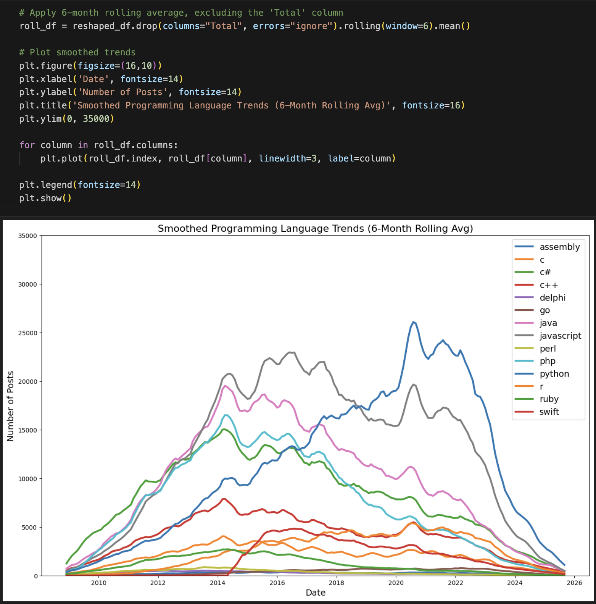

# Language Trend Analysis

## Overview
A data analysis project that explores how the popularity of programming languages changed over time using Stack Overflow data (2008–2025).
The project uses pandas for cleaning and reshaping data and Matplotlib for visualizing language trends month by month.

## Skills Learned
- Python (pandas, matplotlib): data cleaning, reshaping, and visualization
- Data Analysis: time-series handling, trend identification
- Insight Generation: comparing growth and decline of major programming languages

## Final Visualization

